= Chapter 1: Introduction and Goals

*Contents*

* <<1.1 Introduction>>
** <<1.1.1 Silicon Economy>>
** <<1.1.2 Blockchain Broker as a Silicon Economy Platform Component>>
* <<1.2 Requirements Overview>>
* <<1.3 Quality Goals>>
* <<1.4 Stakeholders>>

== 1.1 Introduction

=== 1.1.1 Silicon Economy

In a Silicon Economy, services are executed and used via platforms.
A Silicon Economy Platform consists of five different kinds of major components, namely one or more SE Services, one or more IDS connectors, a Logistics Broker, an optional IoT Broker and an optional blockchain network based on modules from the Blockchain Broker.
This platform is the environment of SE Services, its location does not matter (e.g., IT environment of a company, a cloud environment, etc.).

SE Services are professional (logistics) services, consisting of IT and/or physical services.
They are part of a functional (logistics) process and can be linked and subsequently orchestrated in the sense of that process.

* *IDS Connector:* Industrial Data Space Connector -Used for secure communication of various contents and management of access rights to various data. (_not yet integrated_)

* *Logistics Broker:* Logistics brokers organize logistics services and their processing and connect the providers of logistics services with customers and users.
This applies equally to internal and external logistics. (_not yet integrated_)

* *SE Service:* SE Services are professional (logistics) services, consisting of IT and/or physical services.
They are part of a functional (logistics) process and can be linked and subsequently orchestrated in the sense of that process.
Furthermore, SE Services can be integrated into existing structures, and must be able to be executed and monitored.
SE Services are documented.
SE Services must be able to be booked and accounted for and have a (technical) description that includes all information about the function of the service and the conditions of use.
Finally, SE Services must be able to be supplied with data and must be able to be called via the IDS. (_integrated_)

* *IoT Broker:* IoT brokers and their components are essential data sources for the Silicon Economy.
They connect the cyberphysical systems (CPS) such as smart containers and pallets, as well as smart machines with the Silicon Economy - e.g., with cloud services and platforms.
IoT brokers trade near-real-time data and information over fixed and (especially) mobile networks such as 5G and low power wide area networks (LPWAN such as NB-IoT...).
The development of open source devices and open source software for IoT devices and CPS are also located here. (_integrated)_

Furthermore, SE Services can be integrated into existing structures, and must be able to be executed and monitored.
SE Services are documented.
SE Services must be able to be booked and accounted for and have a (technical) description that includes all information about the function of the service and the conditions of use.
Finally, SE Services must be able to be supplied with data and must be able to be called via the IDS.

=== 1.1.2 Blockchain Broker as a Silicon Economy Platform Component

Data integrity is a central requirement for collaboration between various parties of a Silicon Economy.
Only by using data integrity the necessary trust can be established between those parties.
The Blockchain Broker consists of modules that enables services and platform components to integrate various blockchain solutions and functionalities, such as a mapping of physical and digital enterprise assets by using tokens, for storing data in a structural way in the form of digital folders on a blockchain.
Further modules provide blockchain solutions and functionalities for the connection and identification of data sources and sinks of a blockchain network as the basis for executing transactions or smart contracts, and the possibility of mapping roles and controlling access rights to data and smart contracts.
Modules of the Blockchain Broker can be used to create use case specific functionalities for full nodes in a blockchain network.

In the next diagram, the modules and internal structure of a Blockchain Broker can be seen:

== 1.2 Requirements Overview

From an end users’ point of view, the Blockchain Broker reduces the technical barriers to using blockchain by providing various blockchain solutions and functionalities.
We summarize the requirements for the Blockchain Broker, which are detailed in Jira.

*What is the Blockchain Broker*

[arabic]
. A basic component of a Silicon Economy Platform
. A solution to integrate blockchain solutions and functionalities

*Essential Features*

[arabic]
. Mapping of physical and digital enterprise assets by using tokens
. Storing data in a structural way on the blockchain
[arabic]
.. Generic token for representing information, documents, company values, etc.
.. Categorization of tokens in digital folder and aggregation of different digital folders in a wallet
.. Integration of use case specific functions, e.g. mapping of logistical processes, status changes and relations between information by using the Businesslogic Module
. Connection and identification of data sources and sinks of a blockchain network
. Mapping of roles and controlling access rights to data and smart contracts
. Authentication of company employees (not yet implemented)
. User interface for the management of BC accounts, e.g. create, block, deanonymize etc. (not yet implemented)
. Monitoring of the activities of light nodes/clients with regard to plausibility (not yet implemented)
. Orchestration of off-chain smart contracts (not yet implemented)
. Services for voting in the blockchain (e.g., granting validator rights; changes to blockchain stakeholders, etc.) (not yet implemented)
. Billing and payment of services (not yet implemented)
. Use of different blockchain implementations or networks in a use case (e.g., transactions between different Tendermint/Cosmos and Hyperledger blockchains) (not yet implemented)

*Functional requirements*

[arabic]
. Providing a set of modules of generic blockchain solutions and functionalities
. Enabling the usage of these modules for any Silicon Economy Services and platform components
. Ensuring the interoperability between the IDS, the Logistics Broker and IoT Broker with the Blockchain Broker

[[chapter-1-3]]
== 1.3 Quality Goals

The following table describes the top six quality goals of the Blockchain Broker classified by https://en.wikipedia.org/wiki/ISO/IEC_9126[ISO/IEC 9126-1]characteristics.
The order of goals gives a rough idea of their importance.

[cols=",",options="header",]
|===
| *Quality Goal* | *Motivation/Description*
| Reliability (Robustness), Efficiency (Scalability) | Due to the decentralized nature of a blockchain, Reliability (Robustness) is inherent. Depending on the type of blockchain solution, additional nodes can join the blockchain network at will or after prior approval, e.g. by a committee.
| Usability (Simplicity) | For tech-savvy individuals of a Silicon Economy, the use case-specific use of blockchain solutions and functionalities of the blockchain broker must be as simple as possible.
| Functionality (Secure updates) | Minor updates for blockchain solutions and functionalities of the Blockchain Broker must not lead to an error in the application. There might be some major releases that require an adaption of the application that uses the blockchain solutions and functionalities of the Blockchain Broker.
| Usability (Attractiveness) | Modules in the Blockchain Broker are generally not used on their own, but in the course of a use case. In the course of this, the modules must appeal the blockchain Administrators and other stakeholders especially in demonstrations.
| Functionality (Completeness) | Every transaction must be broadcasted and processed correctly in the blockchain network.
| Usability / Maintainability | The usage of any modules of the Blockchain Broker must be clear and at the same time include all configuration options for a specific use case.
|===

== 1.4 Stakeholders

The following table lists the most important stakeholders of the Blockchain Broker (person, roles and/or organizations) and their respective expectations, goal and intentions:

[cols=",,",options="header",]
|===
| *Role* | *Description* | *Goal, Intention*
| SE Service User | A SE Service user, who requires information from the real world | Needs data integrity to ensure trust for his/her use case.
| SE Service Owner | Offers a SE Service that required information of the real world | Needs data integrity to ensure trust for his/her SE service.
| Service Developer | Develops an SE Service | Needs a set of modular and easy-to-use solutions and functionalities for data integrity for his/her SE service.
|===

